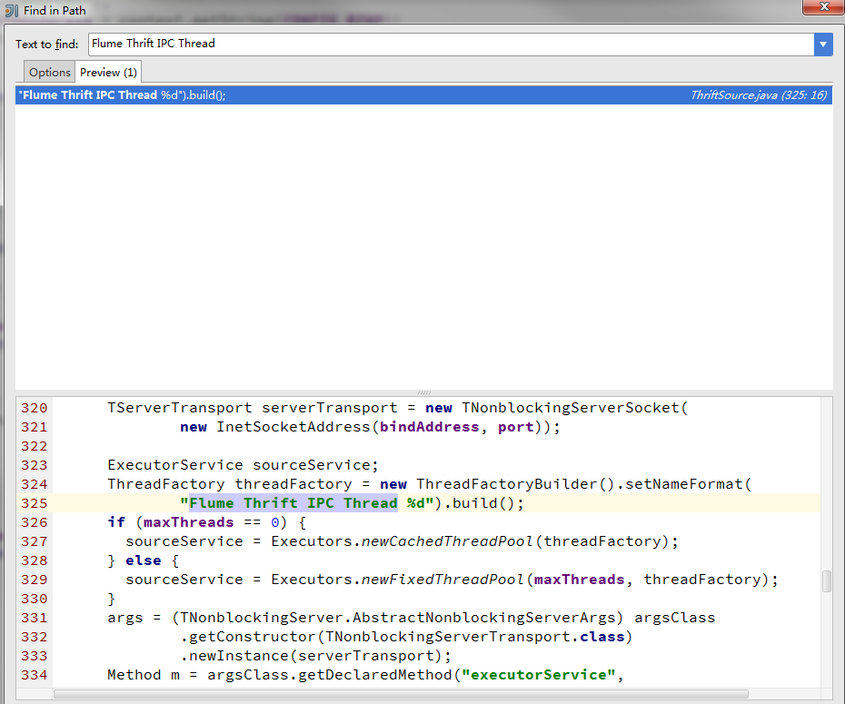
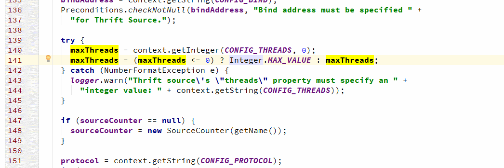

开源代码的使用和学习
====================

要点
======


开源代码的特点
=============

* 文档可能是少且旧
* 细节问题只能在代码中找答案
* 越新的项目坑越多
* 社区的重要性
* 互惠互利原则

如何融入社区，用好社区
=====================

* 使用开源项目
* 反馈
    * 提交bug
    * 提交patch
* 帮助他人


分析过程
========

### 调查形成基本印象

#### 官网

* 获得概貌信息
* 社区、邮件组地址等

#### 搜索引擎

* Google is better than baidu

#### 论坛

* stackoverflow
* stackexchange
* 邮件组

#### 中英结合，掌握一手资料

* 成熟且国内大量应用的项目，找中文资料也可
* 新颖项目可能缺少中文资料
* 真理只在源码中

#### 源码结构性浏览

### 带着问题开始分析
这样具有更强的针对性，有利于注意力集中，避免被大量的代码分散。

  #### 准备记事本，记录分析过程要点

  #### 罗列尽可能多的假设和怀疑

  #### 准备熟悉的IDE工具，解析代码层次

Java推荐IdeaJ

   Python推荐PyCharm

   C/C++用VS+小番茄

#### 构建能跑起来的测试用例

   端到端打通

   便于调试和查看堆栈

#### 开始分析源码

   静态分析和动态运行相结合

   依次验证不同可能性的假设

   更新知识，验证或推翻已有假设，或增加新的假设

   最终找到问题的答案

#### 将问题和分析结果写成文档   


## 例子

这里介绍一个debug的小例子。

问题背景：
我们团队曾经使用过[Apache Flume](http://flume.apache.org/)作为数据传输通道。使用初期，大家对该开源项目并不是特别了解，
遇到过不少问题，很多时候必须深入源码才能正确和高效地使用flume。我们曾经遇到过因为flume的source线程配置不对，导致系统频繁出现OOM的问题。

现象：从日志中可以获得的信息很少
```
Exception in thread "Flume Thrift IPC Thread 14470" java.lang.OutOfMemoryError: Java heap space
```
都是类似这样的信息，差别仅仅是Thread后面的数字不同。

通过分析，我们可以猜测到：
1. 从关键词OutOfMemory和Thread上，我们猜测是某个或某些线程上申请内存失败导致了OOM，但是不清楚是谁吃掉了大量的内存。
2. 日志中有个奇怪的奇怪的线索，出现OOM时，Thread后面的数字都比较大，多超过了1万。假如这个数字代表是线程号，那么很可能是某个逻辑出错，产生了大量的线程。因为我们知道Java进程中[线程ID是从1开始的正整数](http://docs.oracle.com/javase/7/docs/api/java/lang/Thread.html#getId())。

有了猜想，我们需要来验证，验证过程关键点如下：
1. 准备flume相关的所有源码，加载到IDE或习惯使用的文本编辑器中。
2. 根据日志中的"Flume Thrift IPC Thread"关键词进行全文搜索，减小范围，定位到org.apache.flume.source.ThriftSource这个文件。
3. 阅读相关代码，找到问题答案。

因为Flume是一个用Java编写的项目，我这里用IdeaJ来加载所有代码，首先用全文检索“ctr+shift+F”功能，检索结果如下，

很幸运，仅有一个文件出现了该关键字。

阅读这部分代码，可以知道：
1. 搜索的关键字是作为线程名的格式化字符串使用的。
2. 图中324-325行从类名、变量名上都可以猜测，是生成了一个线程工厂实例，而具体线程将做什么操作是没有确定。
3. 从326-330行，我们可以知道，根据`maxThreads`变量是否等于0，来构造不同的线程池`sourceService`，查看JDK中关于`Executors.newCachedThreadPool`和`Executors.newFixedThreadPool`都没有什么异常，因为线程池就是为了复用，怎么会导致OOM呢？
4. 实际上问题就是出在329行，固定线程数的线程池如果线程数设置成非常大，那么一样会不停地向系统申请资源创建线程哦。根本原因就在于`maxThreads`变量的值不合理。
5. 接着我们找到`maxThreads`设置的地方，见下图, 从代码中可以知道当用户没有设置`CONFIG_HREADS`时，140行代码将会设置`maxThreads = 0`，而接着的141行却会因为其等于0而将其设置成`integer.MAX_VALUE`，而这个值是非常大的，等于2^31-1。

此时我们知道这块代码实现上不太合理，当用户没有设置线程数时，默认的行为居然是走到2^31-1这么大的线程池里面。
当不断有新请求过来，flume处理上会向`sourceService`线程池申请一个可用的线程对象，如果老的请求是长任务，那么老任务可能根本没有结束，
又因为当前线程数没有超过设定的上限，那么`sourceService`就会向系统申请内存来创建新的线程。如此反复，当系统运行到一定时间，必然会爆发OOM的问题。

找到原因后，我们增加了配置参数，设定了线程数为合理的数值，后面测试就没有发现这个问题。

工具介绍
=============

* everything
* win快捷键
