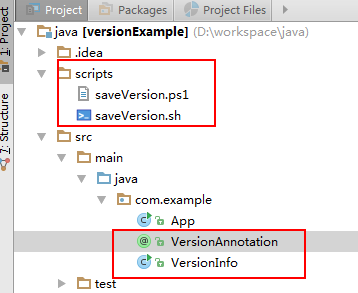
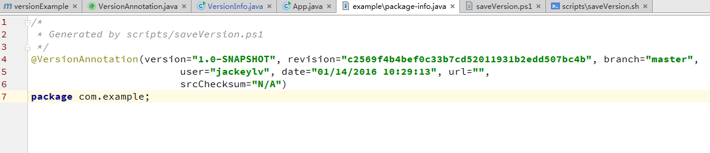
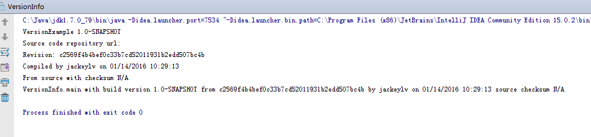

Java项目中自动加入编译时版本信息
================================

最近从[Apache Flume](http://flume.apache.org)这个开源项目源码中学到一个好玩也实用的技巧：自动更新项目编译/打包时的版本信息，便于跟踪定位发布的版本。
仔细分析了实现原理后感觉这东西真的不错，好东西不敢独享，总结一下供需要之人索取，同时写明使用方法和原理，以便能够正确无误使用。

原理概要
========
一句话概述就是：利用Maven插件执行外部命令获取编译打包时的版本信息，将版本信息加入自定义的包级注释中，那么代码中获取的版本信息就是此处更新的注释数据。
这么一条似乎是三句话的一句话包含了其原理和执行过程：

1. 利用[antrun]执行外部命令或脚本来获得编译时的版本信息，并写入到[包级注释文件][package-info]中。
2. 利用[build-helper]插件将生成的[包级注释文件][package-info]加入到编译/打包目标文件中，以便发布后可获得正确信息。
2. 项目自定义实现的获取版本信息方法，从注释中获取数据。

具体的原理实现见后面的[源码解析](#source)。

使用方法和注意事项
==============

使用方法比较简单，该方法也适用于Windows和Linux环境，Mac下没有实验，但应该与Linux类似。

### 前提条件

1. 操作系统的PATH环境变量中有svn或git命令，并且与项目实际的版本控制类型相同。
2. 项目是用Maven pom文件管理。

### 使用方法

1. 项目中增加获取版本信息的注释类和方法类，以及生成版本信息的脚本，如。
2. 项目Pom文件中增加[antrun]和[build-helper]插件的使用，详见[源码解析](#source)。

### 验证

1. 项目编译和打包时，target目录下会生成[package-info]文件，文件中会加入注解数据，如图.
2. 执行获取版本信息的代码，将打印出编译时的版本信息，如

源码解析<a name="source"></a>
==========

### Pom中[antrun]和[build-helper]插件的使用

此处的代码是在pom.xml中使用的，其xml path是project/profiles。这里有两个知识点：
1. 每个profile代表不同的操作系统，用于区分Windows还是非Windows，以便在不同profile下调用不同的外部脚本。
2. 插件的功能都是一样的，先调用maven-antrun-plugin来执行外部脚本生成package-info.java文件，该文件因为是动态变化的，不适合引入到版本库，所以生成目录是target。然后接着调用插件build-helper-maven-plugin将前面生成的代码加入到pom工程中，如此我们编写的获取版本信息的代码才能获得真实数据。

```XML
<profiles>
    <profile>
      <id>not-windows</id>
      <activation>
        <os>
          <family>!Windows</family>
        </os>
      </activation>
      <build>
        <plugins>
          <plugin>
            <groupId>org.apache.maven.plugins</groupId>
            <artifactId>maven-antrun-plugin</artifactId>
            <version>1.7</version>
            <executions>
              <execution> <!-- ant工具命令，依次执行target下的命令 -->
                <id>generate-version</id>
                <phase>generate-sources</phase>
                <configuration>
                  <target>
                    <mkdir dir="${project.build.directory}/generated-sources/java"/>
                    <exec executable="sh">
                      <!-- 调用外部脚本saveVersion.sh来获取版本信息，并写入到目标文件 -->
                      <arg 
                              line = "${basedir}/scripts/saveVersion.sh ${project.version} ${project.build.directory}" />
                    </exec>
                  </target>
                </configuration>
                <goals>
                  <goal>run</goal>
                </goals>
              </execution>
            </executions>
          </plugin>

          <plugin>
            <groupId>org.codehaus.mojo</groupId>
            <artifactId>build-helper-maven-plugin</artifactId>
            <version>1.7</version>
            <executions>
              <execution>
                <id>add-source</id>
                <phase>generate-sources</phase>
                <goals>
                  <goal>add-source</goal>
                </goals>
                <configuration>
                  <sources>
                    <source>target/generated-sources/java</source>
                  </sources>
                </configuration>
              </execution>
            </executions>
          </plugin>

        </plugins>
      </build>
    </profile>

    <profile>
      <id>windows</id>
      <activation>
        <os>
          <family>Windows</family>
        </os>
      </activation>
      <build>
        <plugins>
          <plugin>
            <groupId>org.apache.maven.plugins</groupId>
            <artifactId>maven-antrun-plugin</artifactId>
            <version>1.7</version>
            <executions>
              <execution>
                <id>generate-version</id>
                <phase>generate-sources</phase>
                <configuration>
                  <target>
                    <mkdir dir="${project.build.directory}/generated-sources/java"/>
                    <exec executable="powershell">
                      <arg
                              line = "-executionpolicy unrestricted -file ${basedir}\scripts\saveVersion.ps1  ${project.version} ${project.build.directory}" />
                    </exec>
                  </target>
                </configuration>
                <goals>
                  <goal>run</goal>
                </goals>
              </execution>
            </executions>
          </plugin>

          <plugin>
            <groupId>org.codehaus.mojo</groupId>
            <artifactId>build-helper-maven-plugin</artifactId>
            <version>1.7</version>
            <executions>
              <execution>
                <id>add-source</id>
                <phase>generate-sources</phase>
                <goals>
                  <goal>add-source</goal>
                </goals>
                <configuration>
                  <sources>
                    <source>target/generated-sources/java</source>
                  </sources>
                </configuration>
              </execution>
            </executions>
          </plugin>

        </plugins>
      </build>
    </profile>
  </profiles>
```

### Annotation和版本信息代码

1. 获取版本信息的Java代码，核心内容如下
```Java
package com.example;

/**
 * Created by jackeylv on 2016/1/13.
 */
public class VersionInfo {

    private static Package myPackage;
    private static VersionAnnotation version;

    static {
        // 获取VersionAnnonation类所在package对象，利用ClassLoader找到对应的package
        myPackage = VersionAnnotation.class.getPackage();
        // 获取package对象内包括的VersionAnnotation注解
        version = myPackage.getAnnotation(VersionAnnotation.class);
    }

    /**
     * Returns the build version info which includes version,
     * revision, user, date and source checksum
     */
    public static String getBuildVersion(){
        return VersionInfo.getVersion() +
                " from " + VersionInfo.getRevision() +
                " by " + VersionInfo.getUser() +
                " on " + VersionInfo.getDate() +
                " source checksum " + VersionInfo.getSrcChecksum();
    }
｝    
```
2. 版本信息的Annotation代码，
```Java
package com.example;

import java.lang.annotation.ElementType;
import java.lang.annotation.Retention;
import java.lang.annotation.RetentionPolicy;
import java.lang.annotation.Target;

/**
 * This class is about package attribute that captures
 * version info of project that was compiled.
 */
@Retention(RetentionPolicy.RUNTIME)
@Target(ElementType.PACKAGE)
public @interface VersionAnnotation {
    /**
     * Get the Project version
     * @return the version string "1.1"
     */
    String version();

    /**
     * Get the subversion revision.
     * @return the revision number as a string (eg. "100755")
     */
    String revision();

    /**
     * Get the branch from which this was compiled.
     * @return The branch name, e.g. "trunk"
     */
    String branch();

    /**
     * Get the username that compiled Project.
     */
    String user();

    /**
     * Get the date when Project was compiled.
     * @return the date in unix 'date' format
     */
    String date();

    /**
     * Get the url for the subversion repository.
     */
    String url();

    /**
     * Get a checksum of the source files from which
     * Project was compiled.
     * @return a string that uniquely identifies the source
     **/
    String srcChecksum();
}
```
3. 生成的版本信息示例，
```Java
/*
 * Generated by scripts/saveVersion.ps1
 */
@VersionAnnotation(version="1.0-SNAPSHOT", revision="c2569f4b4bef0c33b7cd52011931b2edd507bc4b", branch="master",
                         user="jackeylv", date="01/14/2016 10:29:13", url="",
                         srcChecksum="N/A")
package com.example;
```

### 生成版本信息的外部脚本
Windows下是用PS1脚本编写，原理与Linux下的大体相同，这里以Linux实现为主。
```bash
# 修养unset来避免中文环境下svn命令输出的异常
unset LANG
unset LC_CTYPE
unset LC_TIME

# 记录外面传递的参数
version=$1
buildDirectory=$2

# 获取用户等基本信息
user=`whoami`
date=`date`
dir=`pwd`
cwd=`dirname $dir`

# 获取版本等信息
# 修改点1：根据实际.svn路径来修改参数，用于判断是svn还是git。
if [ -d .svn ]; then
revision=`svn info ../ | sed -n -e 's/Last Changed Rev: \(.*\)/\1/p'`
url=`svn info  ../ | sed -n -e 's/URL: \(.*\)/\1/p'`
branch=`echo $url | sed -n -e 's,.*\(branches/.*\)$,\1,p' \
                          -e 's,.*\(tags/.*\)$,\1,p' \
                          -e 's,.*trunk$,trunk,p'`
elif git rev-parse HEAD 2>/dev/null > /dev/null ; then
revision=`git log -1 --pretty=format:"%H"`
hostname=`hostname`
branch=`git branch | sed -n -e 's/^* //p'`
url="git://${hostname}${cwd}"
else
revision="Unknown"
branch="Unknown"
url="file://$cwd"
fi

# 获取所有源码校验和信息
# 修改点2：根据需要来查找某个目录下的某些文件，以对其生成校验和。此处是当前目录下的所有java源文件
if [ -n "$(which md5sum)" ]; then
  srcChecksum=`find ./ -name '*.java' | grep -v generated-sources | LC_ALL=C sort | \
      xargs md5sum | md5sum | cut -d ' ' -f 1`
else
  srcChecksum=`find ./ -name '*.java' | grep -v generated-sources | LC_ALL=C sort | \
      xargs md5 | md5 | cut -d ' ' -f 1`
fi

# 修改点2：根据实际的命名空间来创建目录
mkdir -p $buildDirectory/generated-sources/java/com/example/
# 修改点3：根据实际的命名空间来设定生成文件的目录
cat << EOF | \
  sed -e "s/VERSION/$version/" -e "s/USER/$user/" -e "s/DATE/$date/" \
      -e "s|URL|$url|" -e "s/REV/$revision/" \
      -e "s|BRANCH|$branch|" -e "s/SRCCHECKSUM/$srcChecksum/" \
      > $buildDirectory/generated-sources/java/com/example/package-info.java
/*
 * Generated by scripts/saveVersion.sh
 */
@VersionAnnotation(version="VERSION", revision="REV", branch="BRANCH",
                         user="USER", date="DATE", url="URL",
                         srcChecksum="SRCCHECKSUM")
package com.example; # 修改点4：根据实际命名空间修改
EOF
```

结束语
======

感谢开源项目[Apache Flume]。

参考文献
=========
1. [package-info.java文件详解](http://blog.csdn.net/chszs/article/details/45727249) <http://blog.csdn.net/chszs/article/details/45727249>
1. [另类的package-info.java文件探讨](http://strong-life-126-com.iteye.com/blog/806246) <http://strong-life-126-com.iteye.com/blog/806246>
2. [maven-antrun-plugin](https://maven.apache.org/plugins/maven-antrun-plugin/) <https://maven.apache.org/plugins/maven-antrun-plugin/>
3. [build-helper-maven-plugin](http://www.mojohaus.org/build-helper-maven-plugin/add-source-mojo.html) <http://www.mojohaus.org/build-helper-maven-plugin/add-source-mojo.html>
4. [Apache Flume](http://flume.apache.org/) <http://flume.apache.org>

[package-info]: http://strong-life-126-com.iteye.com/blog/806246 "另类的package-info.java文件探讨"
[antrun]: https://maven.apache.org/plugins/maven-antrun-plugin/ "Apache Maven AntRun Plugin"
[build-helper]: http://www.mojohaus.org/build-helper-maven-plugin/add-source-mojo.html "MojoHuas build-helper:add-source"
[Apache Flume]: http://flume.apache.org "Apache Flume"